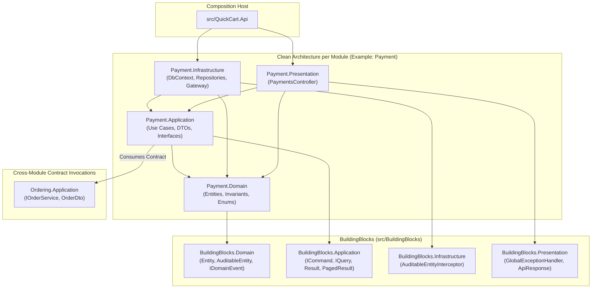

# Module Dependencies & Clean Architecture Layering

This diagram illustrates the inward dependency flow of Clean Architecture across the 8 business modules, the shared BuildingBlocks foundation, and cross-module contract interactions.

---

