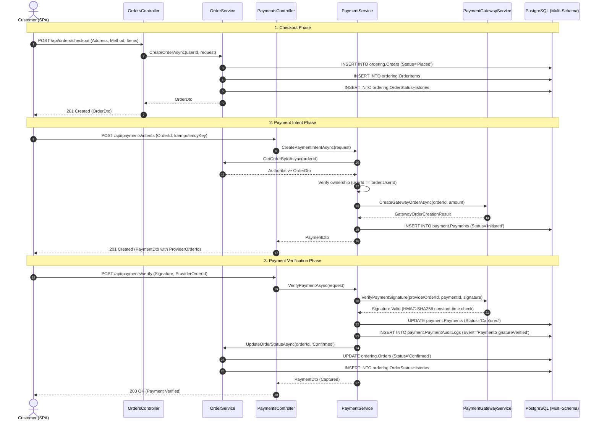
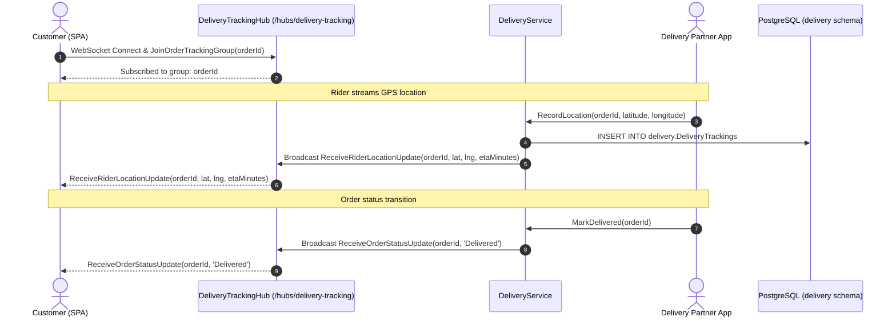

# Request Flow Sequence Diagrams

This document contains sequence diagrams illustrating the end-to-end request and event execution flows for order checkout, payment verification, and real-time delivery telemetry.

---

## 1. Order Checkout & Payment Verification Flow

---

## 2. Real-Time Delivery Tracking Flow

