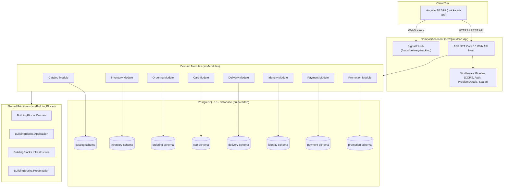

# System Overview Architecture Diagram

This diagram visualizes the overall architecture of QuickCart: the client tier, the unified ASP.NET Core API host, the 8 autonomous domain modules, shared building blocks, and the multi-schema PostgreSQL persistence layer.

---

